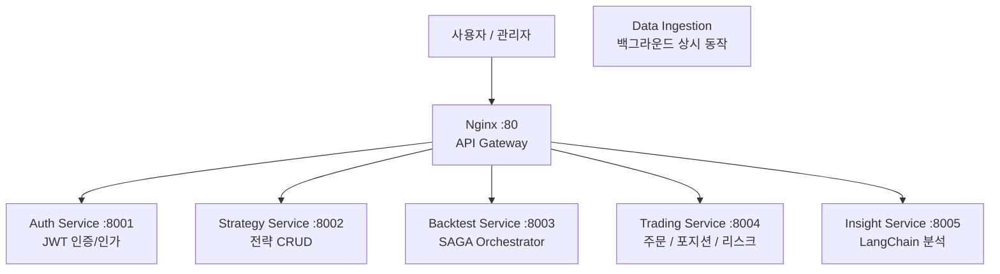
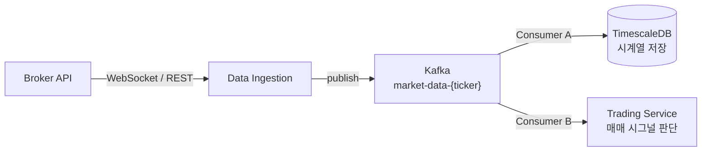
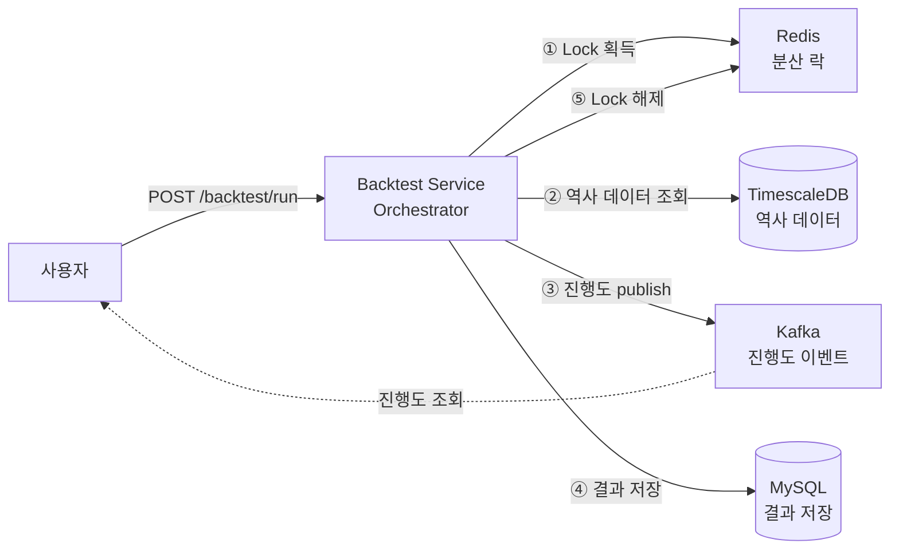

이전 포스트에서 아키텍처를 한 번 뒤엎은 적이 있다. 그때는 Gateway 서버 부하 문제와 시세 수집 주기 문제가 원인이었다.

이번엔 더 근본적인 재설계다. 코드를 짜기 전에 RFC(Request for Comments)를 먼저 작성하고, 각 결정의 이유를 기록하는 방식으로 진행했다.

---

## 이전 아키텍처의 문제

이전 설계는 Gateway 서버 중심의 단순한 MSA였다. 시세 데이터는 1시간 주기 REST 폴링, 백테스트는 Gateway가 직접 호출하는 구조였다.

실제로 구현해보려 하니 세 가지 문제가 명확해졌다.

**1. 서로 다른 성격의 워크로드를 어디에 올릴 것인가**

| 워크로드 | 특성 |
|---|---|
| 실시간 시세 수집 | 수초 간격, 장중 12시간 상시 동작 |
| 백테스트 실행 | 수 분~수십 분, CPU 집약적 |
| 사용자 API 요청 | 빠른 응답, CRUD |

이 셋을 같은 서버에 올리면 백테스트 연산이 사용자 API 응답을 지연시킨다.

**2. 시세 데이터를 여러 서비스가 동시에 필요로 한다**

Trading Service도 실시간 시세가 필요하고, TimescaleDB 저장도 해야 한다. HTTP 직접 호출로 연결하면 한 서비스가 재시작될 때 데이터가 유실된다.

**3. 백테스트는 긴 실행 시간 동안 상태를 추적해야 한다**

"지금 몇 % 진행됐나요?"를 사용자가 물어볼 수 있어야 한다. 단순한 HTTP 요청-응답으로는 이걸 해결할 수 없다.

---

## 새 아키텍처

하나의 다이어그램에 모든 것을 담으면 관계선이 너무 많아진다. 세 가지 관점으로 나눠서 보는 게 더 명확하다.

### 서비스 레이어 구조



사용자 요청은 Nginx를 거쳐 각 서비스로 라우팅된다. Data Ingestion은 사용자 요청을 받지 않는 백그라운드 프로세스다.

---

### 실시간 시세 파이프라인



Kafka가 중간에 있기 때문에 TimescaleDB와 Trading Service 중 어느 하나가 재시작되어도 데이터가 유실되지 않는다. Consumer가 올라오면 Kafka offset부터 다시 소비한다. 새 소비자가 생겨도 INGEST 코드는 건드리지 않아도 된다.

---

### 백테스트 SAGA 흐름



Backtest Service가 전체 흐름을 직접 지시한다(Orchestration). 각 단계가 이벤트로 흩어지지 않아 장애 시 어느 단계에서 멈췄는지 한눈에 파악할 수 있다.

---

## 각 결정의 이유

### 이중 DB: MySQL + TimescaleDB

"왜 DB를 두 개 쓰냐"는 질문을 먼저 받는다.

비즈니스 데이터(주문, 포지션, 전략 정의, 백테스트 결과)와 시계열 시세 데이터는 **쿼리 패턴이 근본적으로 다르다.**

```sql
-- MySQL이 잘하는 것: 트랜잭션, JOIN, CRUD
SELECT * FROM orders WHERE user_id = 1 AND status = 'filled';

-- TimescaleDB가 잘하는 것: 시계열 range 쿼리
SELECT * FROM market_data
WHERE ticker = 'AAPL' AND time > now() - INTERVAL '3 years';
```

TimescaleDB는 시간 컬럼 기준으로 데이터를 Chunk 단위로 물리적으로 분리한다(Hypertable). 3년치 range 쿼리를 할 때 관련 Chunk만 읽으면 되기 때문에 일반 RDBMS 대비 수십 배 빠르다.

주문 내역을 TimescaleDB에 넣으면 트랜잭션 정합성 보장이 어렵고, 시세 데이터를 MySQL에 넣으면 range 쿼리가 풀 테이블 스캔이 된다. 두 개를 쓰는 게 맞다.

---

### Kafka: 실시간 fan-out

Data Ingestion이 WebSocket으로 시세를 수신할 때, **이 데이터가 필요한 곳이 두 군데**다.

```
시세 데이터
  ├─→ TimescaleDB 저장 (영속화)
  └─→ Trading Service (실시간 매매 시그널 판단)
```

HTTP 직접 호출로 이걸 구현하면, Trading Service가 재시작되는 순간 시세가 유실된다. Data Ingestion이 Trading Service의 가용성에 결합된다.

Kafka는 이 결합을 끊는다. 컨슈머가 재시작되면 Kafka offset부터 재소비할 수 있다. 나중에 Insight Service가 실시간 변동 감지를 해야 한다면 consumer group만 하나 추가하면 된다. Data Ingestion 코드는 손대지 않아도 된다.

---

### Backtest SAGA: Choreography 말고 Orchestration

백테스트는 순서가 정해진 워크플로우다.

```
① Redis Lock 획득 (중복 방지)
② TimescaleDB에서 역사 데이터 조회
③ Backtrader 연산 (CPU 집약)
④ MySQL에 결과 저장
⑤ Lock 해제 + Kafka에 완료 이벤트
```

SAGA 패턴에는 두 가지 구현 방식이 있다.

- **Choreography**: 각 단계가 이벤트를 받아 다음 단계를 트리거. 전체 흐름이 여러 Kafka topic에 분산됨
- **Orchestration**: Backtest Service가 전체 흐름을 직접 조율. 단일 함수 안에 워크플로우가 명확히 드러남

Choreography로 구현하면 장애가 났을 때 "어느 단계에서 멈췄는지"를 추적하려면 여러 topic을 다 뒤져야 한다. 백테스트는 순차적 흐름이고 재시도 로직도 Backtest Service가 책임지는 게 자연스럽다.

Orchestration을 선택했다. Kafka는 "진행도 알림"과 "완료 이벤트" 발행 용도로만 쓴다.

---

### Redis: 영속 저장 금지

Redis는 메모리 기반이라 OOM 발생 시 eviction이 일어날 수 있다. 주문 내역이나 백테스트 결과를 Redis에만 저장했다가 날아가면 복구 방법이 없다.

Redis 역할을 세 가지로만 제한한다.

| 용도 | 예시 |
|---|---|
| 분산 락 | `lock:backtest:{dedup_key}` |
| 캐시 | `cache:insight:{ticker}:{date}` (6시간 TTL) |
| 블랙리스트 | `blacklist:access:{jti}` (로그아웃된 JWT) |

MySQL과 TimescaleDB가 단일 정보 소스(SSOT)다.

---

### WebSocket: 폴링이 아닌 이유

이전 설계에서 1시간 폴링 → 5초 폴링으로 바꿨다가, 다시 WebSocket으로 전환했다.

5초 폴링은 장중 12시간 기준 하루 8,640번 API 호출이다. Polygon.io 같은 유료 API는 호출 수 기반 과금이라 비용이 빠르게 쌓인다. WebSocket은 연결 하나로 브로커가 체결 즉시 push해준다.

복잡도가 올라가는 건 사실이다 — 재연결 로직, heartbeat 감지, 재연결 중 갭 추적이 필요하다. 이 복잡도를 추상화 인터페이스 뒤에 숨겼다.

```python
class BrokerDataSource(ABC):
    @abstractmethod
    async def connect(self) -> None: ...

    @abstractmethod
    async def subscribe(self, tickers: list[str]) -> None: ...

    @abstractmethod
    def on_tick(self, callback: Callable[[TickData], Awaitable[None]]) -> None: ...
```

개발/테스트 환경에서는 `MockBrokerDataSource`, 프로덕션에서는 `AlpacaDataSource`. 환경 변수 하나로 전환한다.

---

## 사용자 / 관리자 / 백그라운드 역할 분리

흐름을 보는 주체가 셋이다.

**일반 사용자**
- 백테스트 결과 조회, 백테스트 실행 요청, 주가 변동 분석 조회, 주문 체결

**백그라운드 프로세스**
- 증권사 WebSocket 연결 유지 및 시세 수집
- 장 마감 후 자동 갭 백필 (yfinance)
- 백테스트 실행 및 진행도 이벤트 발행

**관리자**
- 전략 추가 및 삭제 (기존 데이터는 보존)

관리자와 일반 사용자 구분은 Phase 8(인증/인가 도입) 전까지 `X-User-Role` 헤더로 임시 처리한다. 모든 서비스의 `require_admin()` 의존성 함수 하나만 바꾸면 JWT로 전환된다.

---

다음 편에서는 전체 Phase 계획과 Phase 1에서 shared 코드를 어떻게 분리해서 사용하는지를 다룬다.
